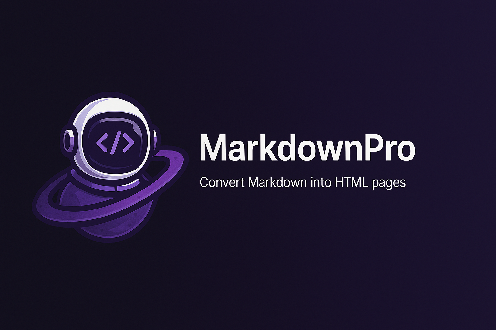

# 📝 Markdown Pro

A stunning, modern Markdown editor and converter built with React, TypeScript, and Tailwind CSS. Transform your markdown writing experience with a beautiful UI, real-time preview, and multiple export options.



## ✨ Features

- 🎨 **Beautiful UI/UX** - Modern, clean interface with smooth animations
- 🌓 **Multiple Themes** - Choose from a variety of carefully crafted themes
- 📱 **Responsive Design** - Works perfectly on desktop and mobile devices
- ⚡ **Real-time Preview** - See your markdown rendered instantly
- 💾 **Local Storage** - Auto-saves your work
- 📤 **Export Options** - Download as MD, HTML, or PDF
- 📁 **File Management** - Organize and manage multiple markdown files
- 🔍 **Search & Replace** - Quickly find and replace text
- 🎯 **Focus Mode** - Distraction-free writing experience
- 🔄 **Version History** - Track changes to your documents

## 🚀 Quick Start

### Prerequisites

- Node.js 18+ (LTS recommended)
- npm or yarn or pnpm

### Installation

1. Clone the repository:

```bash
git clone https://github.com/rafay99-epic/MarkdownPro.git
cd MarkdownPro
```

2. Install dependencies:

```bash
npm install
# or
yarn install
# or
pnpm install
# or
bun install
```

3. Start the development server:

```bash
npm run dev
# or
yarn dev
# or
pnpm dev
# or
bun dev
```

4. Open [http://localhost:4321](http://localhost:4321) in your browser.

## 🛠️ Tech Stack

- **Frontend Framework**: React 18 with TypeScript
- **Styling**: Tailwind CSS + shadcn/ui
- **State Management**: React Query
- **Markdown Processing**: Marked
- **Routing**: React Router
- **Build Tool**: Vite
- **Animations**: Framer Motion
- **Theme Management**: next-themes

## 📦 Project Structure

```
markdown-page-smith/
├── src/
│   ├── components/     # React components
│   ├── pages/         # Page components
│   ├── hooks/         # Custom React hooks
│   ├── lib/           # Utilities and configurations
│   ├── utils/         # Helper functions
│   └── App.tsx        # Main application component
├── public/            # Static assets
└── package.json       # Project dependencies
```

## 🎨 Themes

The application comes with multiple built-in themes:

- Light/Dark mode
- System preference detection
- Custom theme support
- Material Design inspired transitions

## 💻 Usage

1. **Creating a New Document**

   - Click the "New" button
   - Start writing in markdown
   - Your work is automatically saved

2. **Converting Markdown**

   - Write or paste your markdown
   - See real-time preview
   - Export to your desired format

3. **Managing Files**

   - Access saved files from the sidebar
   - Search through your documents
   - Organize with folders

4. **Customizing Experience**
   - Choose your preferred theme
   - Adjust editor settings
   - Configure export options

## 🤝 Contributing

Contributions are welcome! Please feel free to submit a Pull Request. For major changes, please open an issue first to discuss what you would like to change.

1. Fork the repository
2. Create your feature branch (`git checkout -b feature/AmazingFeature`)
3. Commit your changes (`git commit -m 'Add some AmazingFeature'`)
4. Push to the branch (`git push origin feature/AmazingFeature`)
5. Open a Pull Request

## 📄 License

This project is licensed under the MIT License - see the [LICENSE](LICENSE) file for details.

## 🙏 Acknowledgments

- [shadcn/ui](https://ui.shadcn.com/) for the beautiful UI components
- [Tailwind CSS](https://tailwindcss.com/) for the utility-first CSS framework
- [Marked](https://marked.js.org/) for markdown processing
- [Framer Motion](https://www.framer.com/motion/) for smooth animations

## 📞 Support

If you have any questions or need help, please:

1. Check the [Issues](https://github.com/rafay99-epic/MarkdownPro/) page
2. Create a new issue if your problem isn't already listed
3. Reach out through the project's discussions

---

Made with ❤️ by [Abdul Rafay](https://rafay99.com)
